# Nathaniel Alves Ribeiro

**Full Stack Developer**

Desenvolvendo aplicações web modernas utilizando React, TypeScript, Node.js e tecnologias cloud.

---

## 👨‍💻 Sobre

Sou desenvolvedor Full Stack apaixonado por criar aplicações modernas, performáticas e bem estruturadas.

Tenho experiência principalmente com o ecossistema JavaScript/TypeScript, desenvolvendo projetos completos desde a interface até a integração com bancos de dados e autenticação.

Atualmente meus estudos são voltados para arquitetura de software, desenvolvimento web moderno e novas tecnologias do ecossistema React.

---

## 🚀 Tecnologias

### Front-end

### Back-end

### Banco de Dados

### Ferramentas

---

## 📊 GitHub

  
  

---

---

---

## 📫 Contato

* GitHub: https://github.com/Nathan-0088
* LinkedIn: https://www.linkedin.com/in/Nathan0088
* Instagram: https://instagram.com/avs.nathan

---

**Obrigado pela visita!**

Se algum projeto chamou sua atenção, fique à vontade para explorá-lo ou entrar em contato.

